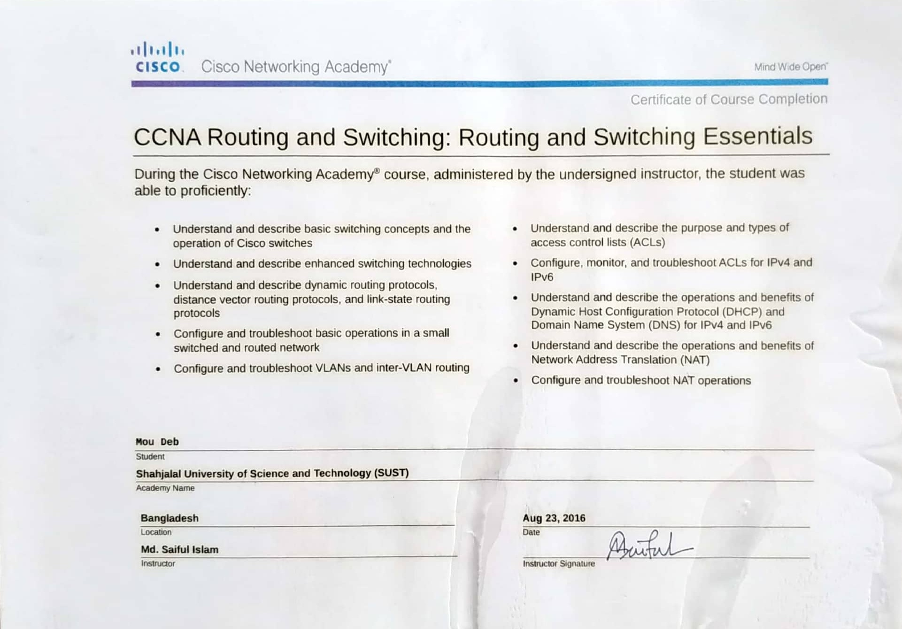

## CCNA (Cisco Certified Network Associate)
I have completed 4 hands-on, lab-oriented courses offered by the **Cisco Networking Academy**. These are – 
* CCNA Routing and Switching: Routing and Switching Essentials
* CCNA Routing and Switching: Introduction to Networks
* CCNA Routing and Switching: Connecting Networks
* CCNA Routing and Switching: Scaling Networks

#### Image
Routing and Switching Essentials: 
  
 Introduction to Networks:  
  
Connecting Networks  
  
Scaling Networks  
  