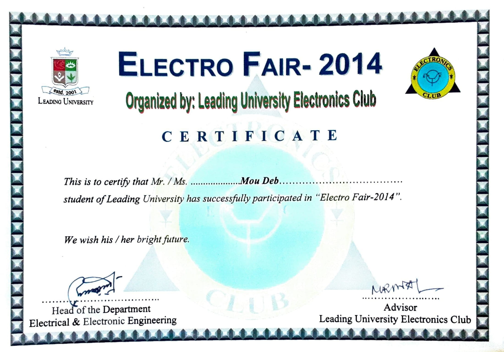

## Electro Fair 2014 – Project Showcasing
Electro Fair 2014 was organized by the Department of Electrical and Electronic Engineering of Leading  University. I have participated in the ‘project showcasing’ category. Our team consists of 4 members. 
  **"Digital door lock to secure access"** was the title of our project. The goal of the project was to improve a home's security. The door is equipped with a keypad. When someone wants to enter, he or she must first enter the correct password. To reset the password, we've offered a master password-based system.

#### Images

