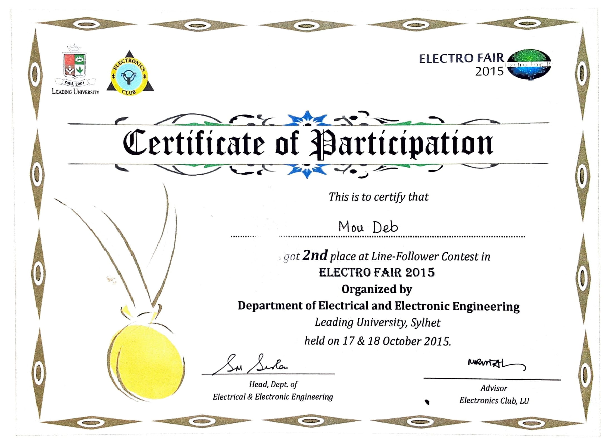

## Electro Fair 2015 – Line Follower
On the 17th and 18th of October 2015, the Department of Electrical and Electronic Engineering of Leading University held a two-day Electro Fair 2015 in its Rangmahal Tower Campus at Zilla Shilpokola Academy, Baluchar, Sylhet. The Electro Fair 2015 featured events such as Project Showcasing, Science Fair, Quiz Contest, Line Follower, and Robofight, in which participants demonstrated their inventive ability and ingenuity.
  I competed in the **"Line Follower"** category. The goal is to create a line-following robot that can run along a specific path. The shape of the tracks varies depending on the stage. We came in second place (**Runner-up**) in the competition.

For more detail, click [here](https://www.lus.ac.bd/news/electro-fair-2015-organized-by-department-of-eee/).

#### Screenshot

