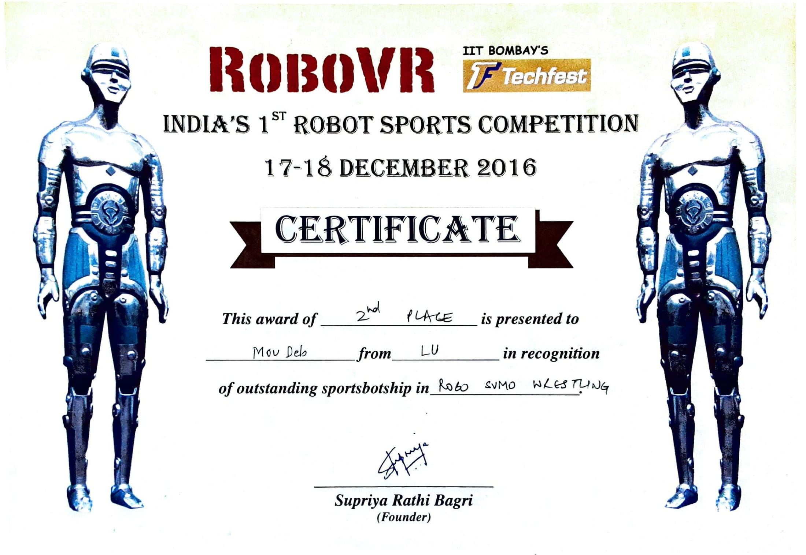

## IIT Bombay RoboVR 2016 
On the 18th of December, 2016, our team, "LU Juddha," came in second place (**Runner-up**) in a tournament conducted by IIT Bombay called "RoboVR Techfest 2016". Following a thrilling final fight against an Indian team, 
we were awarded this place in the category of "**Sumo Robo Wrestling**", a competition in which robots compete in a specific arena.    
In addition, we came in **third place** in another competition called "**FPV Car Racing**".

#### Image

