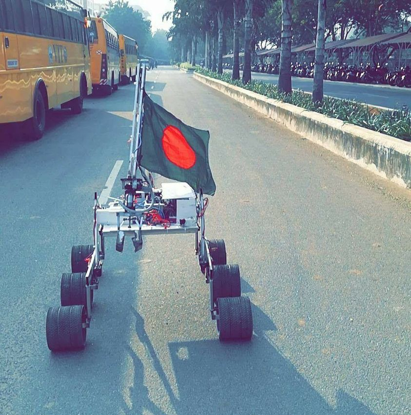
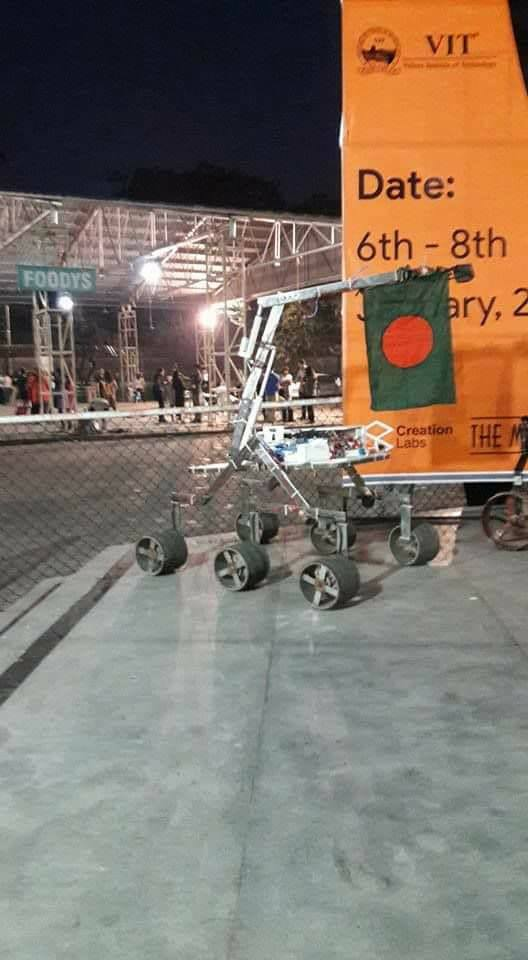
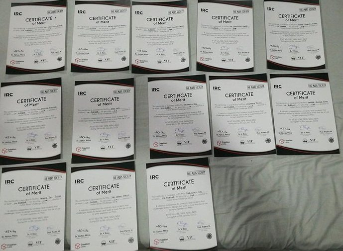

## Indian Rover Challenge (IRC) 2018

Team LU_Durbar from Department of EEE, Leading University achieved **1st position** in National Ranking and **2nd position** in World Ranking in Indian Rover Challenge (IRC) 2018. Indian Rover Challenge(IRC) 2018 program hold in VIT (Vellore Institute of Technology) University, Tamil Nadu, India. 

 The goal is to create a robot that can function in harsh environments such as Mars. We concentrated on two tasks during the design process: navigation and excavation. Our design goal for navigation was to develop it in such a way that it could travel around a very abrupt surface. The robot can also dig the soil and collect minerals for excavation. I am honored to be a part of the LU Durbar team.

#### Images

