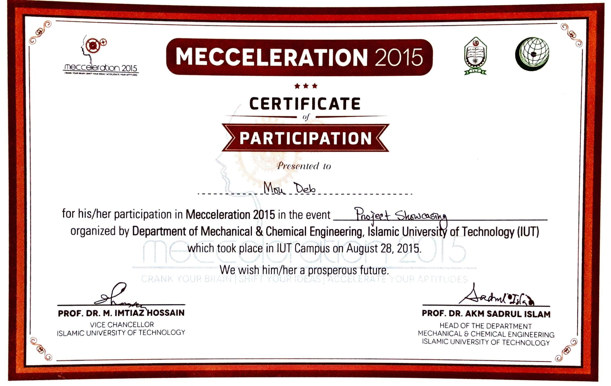

## Mecceleration 2015 – Project Showcasing 
Mecceleration 2015 was arranged by the Department of Mechanical & Chemical Engineering, Islamic University of Technology (IUT). 
  We participated in a project showcase. **"The Third Hand of Blind People"** was the title of our project. We created a virtual hand for blind individuals, as the title suggests. We created gloves that can detect obstacles in the environment. An earphone will be worn by the blind person. The person will be notified through earphones as soon as the hand gloves identify a nearby obstacle. Not only that, but it will also indicate which way the person should move in order to escape the obstacle.

#### Images

