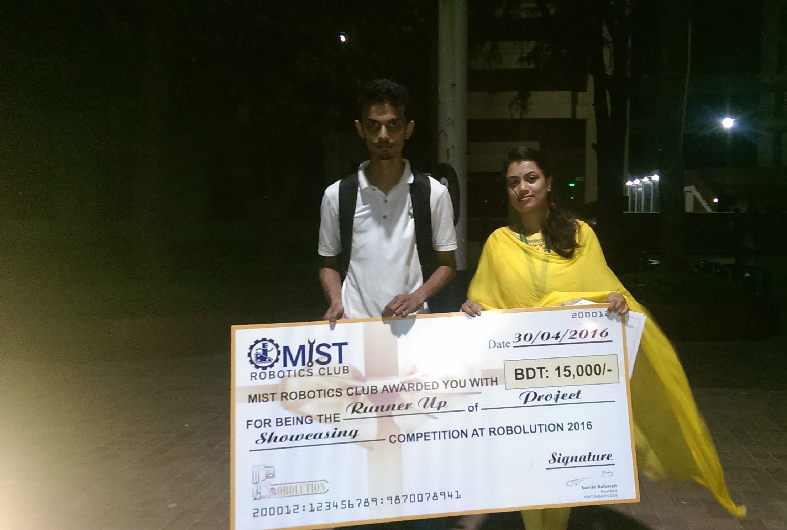
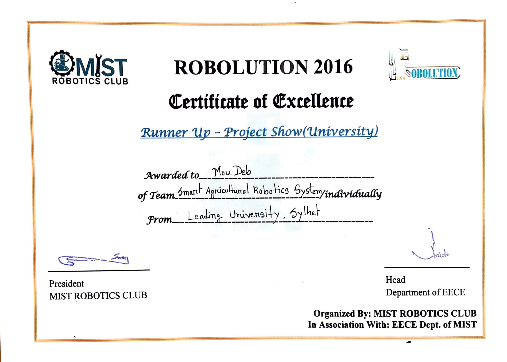

## Robolution 2016 – Project Showcasing
On April 30, 2016, the Robotics Club of the Military Institute of Science and Technology (MIST) hosted the event. Our team consisted of three members, all of them were students of Leading University's Department of Electrical and Electronic Engineering. 
  Our project title was **“Smart Agricultural Robotics System”**. We introduced an Agro-robot that may be used in agriculture as part of the project showcase. Our robot can detect ripe tomatoes automatically. Not only that, 
but it can also pick and store tomatoes in a container, and it can do all of this on its own. Our built robot hand had two functions for harvesting tomatoes: grasping and cutting. The robot hand can reach out and retrieve a ripe tomato from the tree. 
The hand has a movable mechanism that allows it to rotate in any direction and then store the tomato in a container integrated into it. We came in second place (**Runner-up**) in this competition.

For more detail, click [here](https://www.lus.ac.bd/news/agro-robot-from-eee-leading-university-placed-runner-up-in-robolution-2016/).

#### Image

