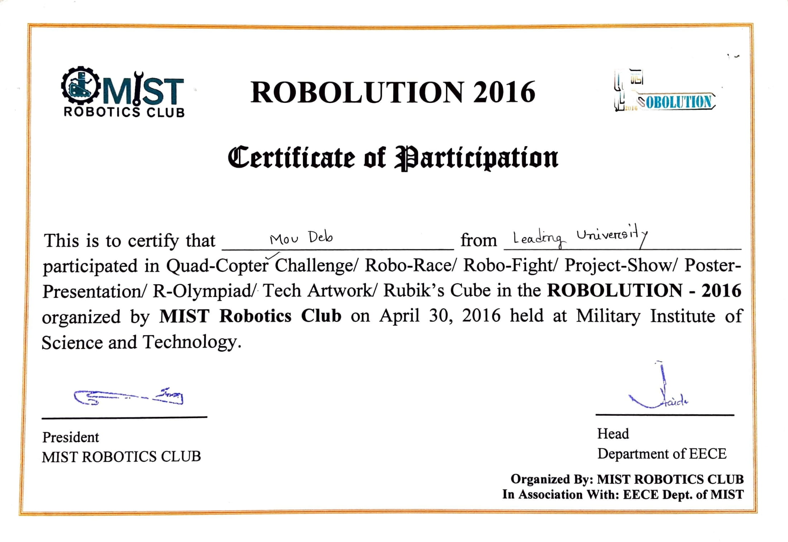

## Robolution 2016 – Quadcopter
On April 30, 2016, the Robotics Club of the Military Institute of Science and Technology (MIST) hosted the event. Our team consisted of three members, all of them were students of Leading University's Department of Electrical and Electronic Engineering. 
  A stage with numerous rings was built for the quadcopter tournament. There was no set size for the rings. The size of the rings shrank as the race progressed. The objective is for your quadcopter to pass the circles. We made it to the third stage out of a total of five. 

#### Image

