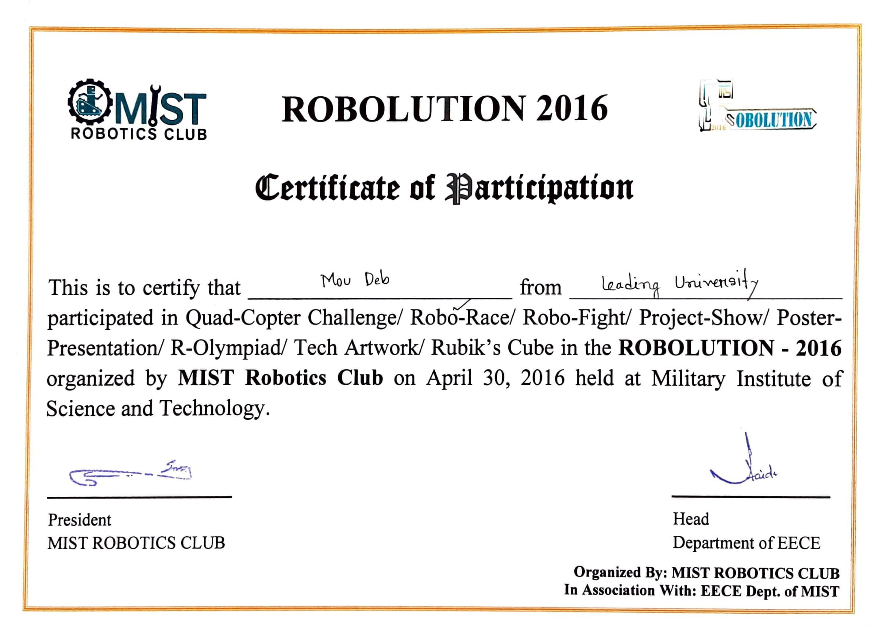

## Robolution 2016 – Robo Race
On April 30, 2016, the Robotics Club of the Military Institute of Science and Technology (MIST) hosted the event. Our team consisted of three members, all of them were students of Leading University's Department of Electrical and Electronic Engineering. 
  The Robo race required a small robot to follow a predetermined path. As new obstacles, loops, and curves were added to each level, the pathways became more difficult. We were successful in reaching the semifinals.

#### Image
