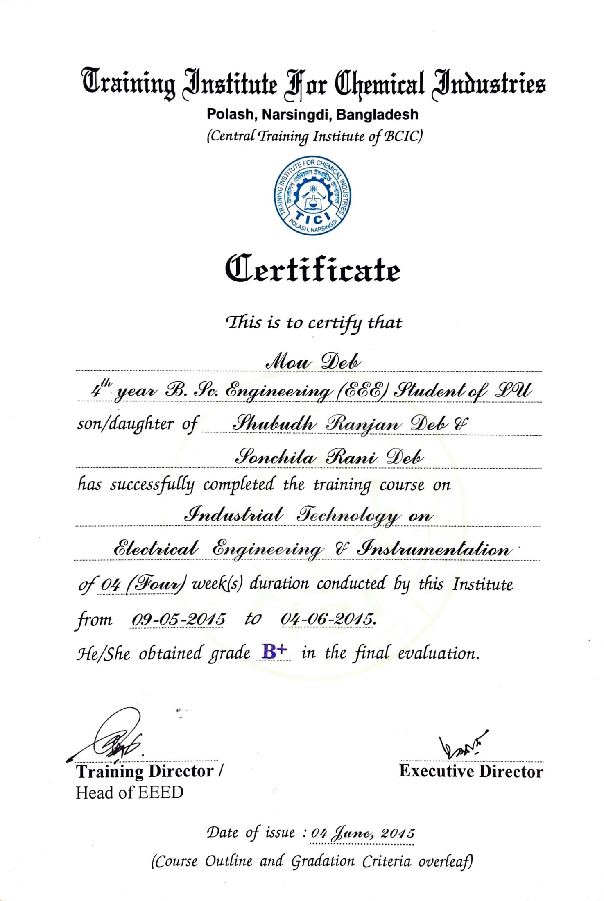

## Training Institute for Chemical Industries (TICI) 2015
I have participated in a month-long industrial attachment at Training Institute for Chemical Industries (TICI), Narsingdi from May 05, 2015, to June 04, 2015. TICI is renowned for its rigorous program, experienced instructors, and well-equipped labs. The training covered the following topics- electrical safety, testing and measurement, transformer, generator, motor, power generation, transmission, distribution, control system, industrial broiler and steam generation, and industrial safety. Trainees attended both theory and associated laboratory classes along with regular written and oral tests. 

#### Image
