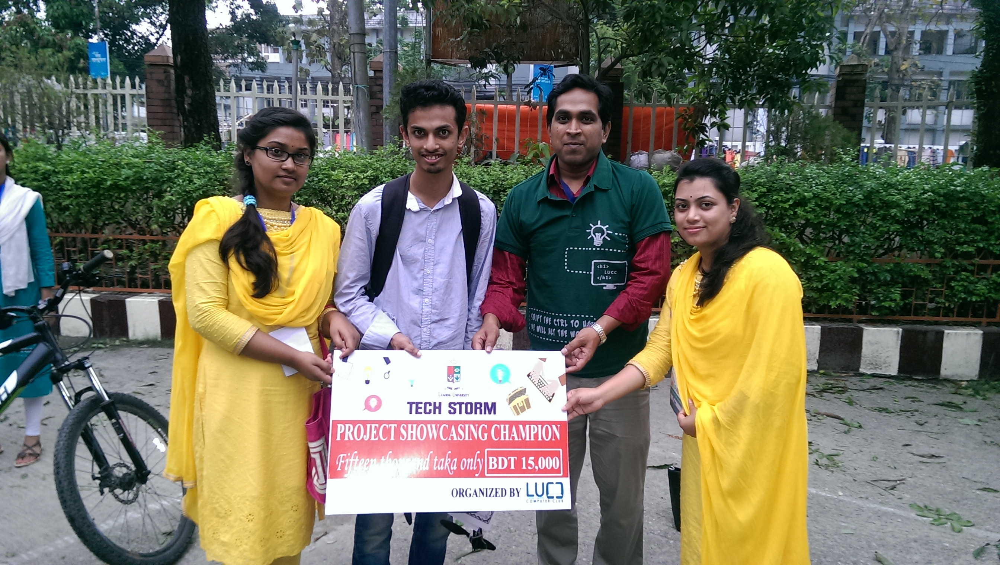
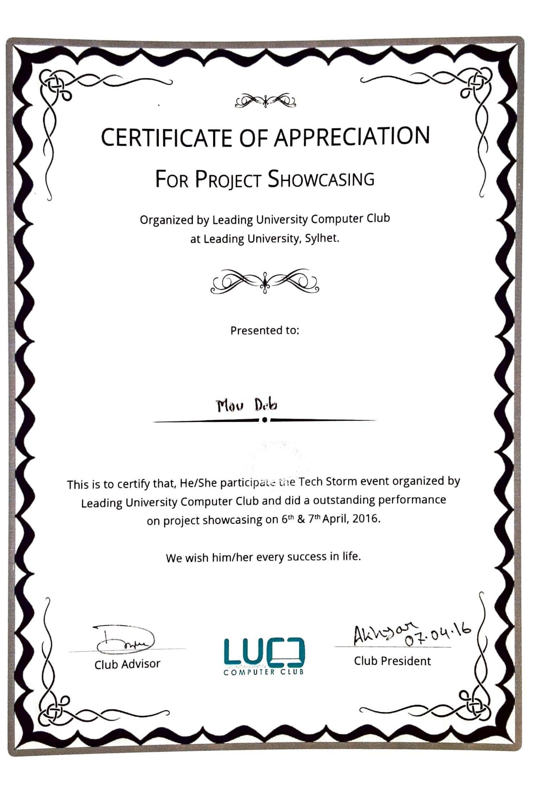

## Tech storm 2016 – Project Showcasing
On the 6th and 7th of April 2016, the Leading University Computer Club hosted a tech storm event. It was a two-day event that provided a one-of-a-kind experience by encouraging students to participate in a variety of mini-events such as project displaying, typing tests, and an online treasure hunt. Our team consisted of three members, all of them were students of Leading University's Department of Electrical and Electronic Engineering.
  As part of the project showcasing, we introduced an **Agro-robot** that might be employed in agriculture. Our robot can automatically detect ripe tomatoes. Not only that, but it can select and store tomatoes in a container all by itself. For picking tomatoes, our robot hand had two functions: grabbing and cutting. A ripe tomato can be retrieved from the tree by the robot hand. The hand is equipped with a moveable mechanism that allows it to rotate in any direction and then store the tomato in an integrated container. We were the **champions** in this competition.

#### Image

